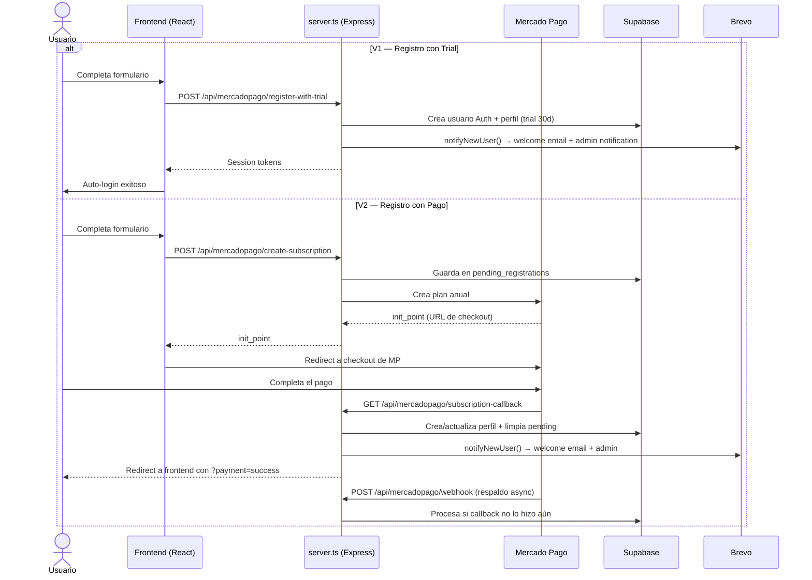
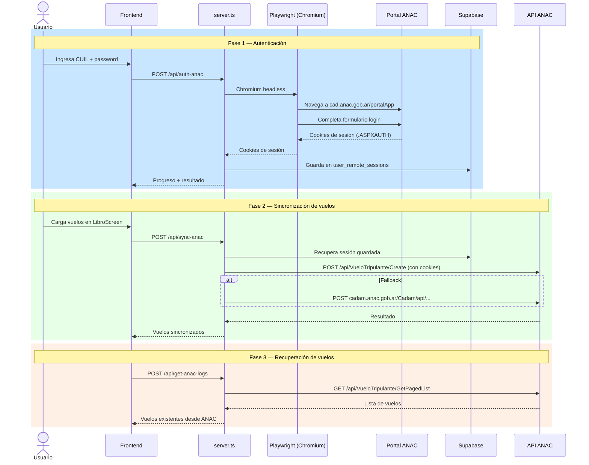
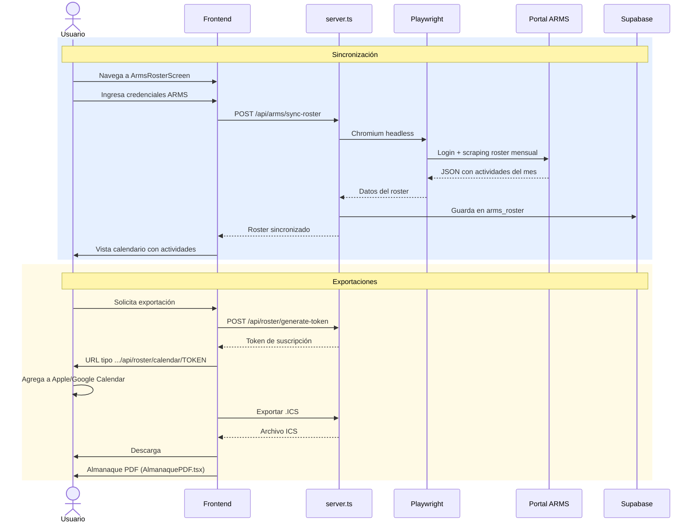

# Manual de la App FlightLog

## Guía completa de arquitectura, funcionamiento y servicios externos

> **Archivos complementarios** en `info_para_modelos_IA/`:
> - `AGENTS.md` — Resumen ultra-condensado para cargar en cualquier modelo de IA
> - `DECISIONES_TECNICAS.md` — Por qué se tomó cada decisión de diseño
> - `ERRORES_CONOCIDOS.md` — Problemas ya resueltos y sus soluciones

---

# 1. Overview y Propósito

FlightLog es una aplicación para **pilotos** que permite:

- **Registrar bitácoras de vuelo** (tramos, horas diurnas/nocturnas, tripulación, simulación)
- **Sincronizar vuelos con ANAC** (Administración Nacional de Aviación Civil de Argentina) — envía los registros directamente al portal de Foliado Web
- **Sincronizar roster con ARMS** — importa la programación mensual de tripulaciones (duty, vuelos, guardias, OFF, etc.)
- **Exportar a calendario (WebCal/ICS)** — suscripción a calendario con Apple/Google Calendar (solo V2)
- **Gestionar suscripción anual** via Mercado Pago
- **Funcionar como PWA + app nativa** (Capacitor) en iOS y Android con soporte offline parcial

Existen **dos versiones** activas:

| Versión | URL | Repositorio | Característica distintiva |
|---|---|---|---|
| **V2 (con roster)** | `https://personal-flight-log-antigravity-render.onrender.com` | `arielbasseterre/personal-flight-log-antigravity` | Roster ARMS + calendario ICS |
| **V1 (sin roster)** | `https://flightlog-sin-roster.onrender.com` | `GRINGOSOFTtv-creator/FLIGHTLOG-SIN-ROSTER` | Trial 30 días |

---

# 2. Estructura del Proyecto

## V2 (`C:\Users\Ariel\Downloads\personal-flight-log`)

```
personal-flight-log/
├── api/
│   ├── arms-scraper.ts          # Scraper de roster ARMS via Playwright
│   └── sync-anac.ts             # Helper de sincronización ANAC
├── components/ui/               # 14 componentes shadcn/ui (Button, Card, Dialog, etc.)
├── public/                      # Assets estáticos (PDF.js, iconos PWA)
├── scripts/                     # Scripts de utilidad (SQL migrations, backup, postinstall)
├── src/
│   ├── App.tsx                  # Componente principal (~2056 líneas, manejo de screens)
│   ├── main.tsx                 # Entry point React
│   ├── index.css                # Estilos globales + Tailwind + clases utilitarias
│   ├── types.ts                 # Definiciones de tipos TypeScript
│   ├── assets/
│   ├── components/
│   │   ├── AlmanaquePDF.tsx         # PDF calendario mensual del roster
│   │   ├── AnacAuth.tsx             # UI de autenticación ANAC
│   │   ├── ArmsRosterScreen.tsx     # Pantalla de roster ARMS
│   │   ├── AuthScreen.tsx           # Login/registro
│   │   ├── FlightLogPDF.tsx         # Generador PDF de bitácora ANAC
│   │   ├── LibroScreen.tsx          # Bitácora de vuelos (CRUD)
│   │   ├── MisEnlacesModal.tsx      # Modal de enlaces de calendario
│   │   ├── PdfViewer.tsx            # Visor PDF embebido
│   │   ├── ProfileScreen.tsx        # Perfil de usuario
│   │   ├── ReportScreen.tsx         # Formulario de reporte de errores
│   │   ├── simulatorsData.ts        # Constantes de simuladores
│   │   └── SubscriptionScreen.tsx   # Gestión de suscripción
│   ├── lib/
│   │   └── airports.ts              # Datos de aeropuertos (IATA/ICAO)
│   └── utils/
│       ├── api.ts                   # Resolución de URL de API (Capacitor-aware)
│       ├── aviation.ts              # Cálculos de tiempos de aviación
│       ├── formatCalendar.ts        # Formateo para calendario
│       ├── ics.ts                   # Generación de archivos ICS
│       ├── offlineQueue.ts          # Cola de sincronización offline
│       ├── push-notifications.ts    # Notificaciones push FCM
│       └── supabase/                # Clientes Supabase (browser + server)
├── supabase/
│   ├── functions/welcome-email/     # Edge Function (Resend, legacy, no conectada)
│   └── schema.sql                   # Schema completo de base de datos
├── server.ts                        # Servidor Express (~2356 líneas)
├── Dockerfile                       # Docker con Playwright
├── vite.config.ts                   # Configuración de Vite
├── tsconfig.json
├── capacitor.config.ts
└── package.json
```

## V1 (`D:\app Antigravity\personal-flight-log sin roster`)

Misma estructura base pero con menos funcionalidades. Diferencias clave:

- **Sin** `ArmsRosterScreen.tsx`, `AlmanaquePDF.tsx`, `MisEnlacesModal.tsx`, `ProfileScreen.tsx`
- **Sin** `utils/formatCalendar.ts`, `utils/ics.ts`
- **Sin** `supabase/schema.sql` (schema consolidado)
- **Sin** endpoints de calendario (`/api/roster/*`)
- **Con** `supabase/functions/send-bug-report-notification/` (Edge Function legacy vía Resend)
- **Con** `scratch/ArmsRosterScreen.tsx` (WIP, no funcional)

---

# 3. Stack Tecnológico

| Capa | Tecnología | Versión |
|---|---|---|
| **Frontend** | React + TypeScript + Vite | React 19, Vite 6 |
| **Backend** | Express + tsx (TypeScript runtime) | Express 4, tsx 4 |
| **Estilos** | Tailwind CSS v4 + shadcn/ui | Tailwind 4 |
| **Base de datos** | Supabase (PostgreSQL) | — |
| **Auth** | Supabase Auth | — |
| **Pagos** | Mercado Pago SDK | mercadopago 3.x |
| **Email** | Brevo API (ex Sendinblue) | — |
| **Scraping** | Playwright (Chromium headless) | 1.59 |
| **Mobile** | Capacitor 6 (Android + PWA iOS) | 6.x |
| **PDF** | @react-pdf/renderer + PDF.js | 4.x |
| **Gráficos** | Recharts | 3.x |
| **IA** | @google/genai (Gemini) | 1.x |
| **Hosting** | Render (Docker) + Vercel (fallback) | — |

## Dependencias npm clave

```json
{
  "@supabase/supabase-js": "^2.103.3",
  "axios": "^1.15.2",
  "express": "^4.22.1",
  "playwright": "^1.59.1",
  "mercadopago": "^3.2.0",
  "helmet": "^8.2.0",           // Solo V2
  "react": "^19.0.0",
  "@react-pdf/renderer": "^4.5.1",
  "recharts": "^3.8.1",
  "@capacitor/core": "^6.0.0",
  "motion": "^12.23.24"         // framer-motion sucesor
}
```

---

# 4. Variables de Entorno

## Definidas en `.env` (local) o Render Dashboard (producción)

| Variable | Dónde se usa | Descripción | V2 | V1 |
|---|---|---|---|---|
| `VITE_SUPABASE_URL` | `server.ts:130` | URL del proyecto Supabase | `https://mexnmpbpqtccaulekupo.supabase.co` | misma |
| `SUPABASE_SERVICE_ROLE_KEY` | `server.ts:131` | Service role key (bypasea RLS) | — | — |
| `VITE_SUPABASE_ANON_KEY` | `server.ts:131` (fallback) | Anon key pública | — | — |
| `BREVO_API_KEY` | `server.ts:133` | API key de Brevo para emails | `xkeysib-...` | misma |
| `MP_ACCESS_TOKEN` | `server.ts:~1531` | Token producción Mercado Pago | `APP_USR-7632150474365901-...` | misma |
| `VITE_API_URL` | `server.ts` (varios) | URL base de la app en Render | `https://personal-flight-log-antigravity-render.onrender.com` | `https://flightlog-sin-roster.onrender.com` |
| `APP_URL` | `server.ts` | URL para back_url de MP | — | — |
| `GEMINI_API_KEY` | Gemini calls | API key de Google Gemini AI | `(ver Render Dashboard)` | misma |
| `PORT` | `server.ts` (final) | Puerto del servidor (Render usa 10000) | 3000 default | misma |
| `NODE_ENV` | `server.ts` | `production` o `development` | — | — |

---

# 5. Servicios Externos e Integraciones

## 5.1 Supabase

- **Cuenta**: Proyecto `mexnmpbpqtccaulekupo.supabase.co`
- **Auth**: Manejo de usuarios (email/password), reset de contraseña, sesiones
- **Database**: PostgreSQL con RLS. Tablas principales:
  - `profiles` — Perfiles de usuario con datos personales, suscripción, tiempo de vuelo
  - `flight_logs` — Registros de vuelo individuales
  - `bug_reports` — Reportes de errores
  - `arms_roster` — Datos de roster ARMS por mes
  - `pending_registrations` — Registros pendientes de pago
  - `calendar_tokens` — Tokens de suscripción a calendario (solo V2)
  - `app_config` — Configuración clave/valor (monto de suscripción)
  - `push_tokens` — Tokens FCM para notificaciones push
  - `user_remote_sessions` — Sesiones del portal ANAC
  - `arms_sessions` — Sesiones del portal ARMS
- **Storage**: Bucket `guia` con PDFs de guía de usuario
- **Edge Functions (legacy, no activas)**:
  - `welcome-email` — Enviaba welcome email via Resend (hoy se hace desde server.ts con Brevo)
  - `send-bug-report-notification` — Solo en V1, enviaba notificación de bug via Resend

## 5.2 Brevo (Email Transaccional)

- **Cuenta**: Asociada a `gringo.soft.ar@gmail.com`
- **API Key**: `(ver variable BREVO_API_KEY en Render Dashboard)`
- **Sender**: `gringo.soft.ar@gmail.com` (nombre: "Personal Flight Log")
- **IP Autorizada en Brevo**: `74.220.48.29` (IP de Render)
- **Función**: Enviar welcome emails a nuevos usuarios + notificaciones al admin
- **Endpoint**: `POST https://api.brevo.com/v3/smtp/email`

## 5.3 Mercado Pago

- **Cuenta**: Asociada a la app, token producción `(ver MP_ACCESS_TOKEN en Render Dashboard)`
- **Producto**: Suscripción anual (plan recurrente de 12 meses)
- **Tipo**: Redirect checkout (no usa CardPayment Brick)
- **Flujo**:
  1. Usuario se registra o renueva
  2. Server crea plan en MP y devuelve `init_point`
  3. Usuario paga en el checkout de MP
  4. MP redirige a `subscription-callback` (el callback)
  5. MP envía webhook a `/api/mercadopago/webhook` (respaldo async)
- **Webhook configurado en MP Dashboard**: Evento "Planes y suscripciones" → `https://personal-flight-log-antigravity-render.onrender.com/api/mercadopago/webhook`
- **Monto**: Configurable en tabla `app_config` (key `subscription_amount`, default $12,000 ARS)

## 5.4 ANAC (Administración Nacional de Aviación Civil)

- **Portal**: `https://cad.anac.gob.ar/portalApp` (fallback: `cadam.anac.gob.ar`)
- **API de vuelos**: `https://cad.anac.gob.ar/foliadoweb/api/VueloTripulante/Create`
- **Mecanismo**: Scraping via Playwright (login con CUIL + password del usuario), luego llamadas Axios a la API REST interna de ANAC
- **Almacenamiento**: Las cookies de sesión se guardan en `user_remote_sessions` de Supabase para reuso
- **Cada usuario** tiene su propio CUIL y contraseña de ANAC, almacenados en el cliente (localStorage para "recordar")

## 5.5 ARMS (Crew Scheduling)

- **Portal**: Sistema de programación de tripulaciones (login con usuario/contraseña del piloto)
- **Mecanismo**: Scraping via Playwright para obtener el roster mensual
- **Sincronización**: Se guarda el JSON del roster en `arms_roster` (user_id, month, year, roster_json)
- **Sesiones**: Se almacenan en `arms_sessions` para no requerir login cada vez
- **Solo V2**: La V1 no tiene roster ARMS funcional

## 5.6 Render (Hosting)

- **Cuenta**: Asociada al email de Ariel
- **V2 URL**: `https://personal-flight-log-antigravity-render.onrender.com`
- **V1 URL**: `https://flightlog-sin-roster.onrender.com`
- **Tipo**: Web Service con Docker (Playwright image)
- **Dockerfile**: `mcr.microsoft.com/playwright:v1.59.1-jammy` → `npx tsx server.ts`
- **Auto-deploy**: Desde GitHub, rama `main`
- **Variables de entorno**: Seteadas en Render Dashboard (ver sección 4)

## 5.7 GitHub

| Versión | Repositorio | Rama principal |
|---|---|---|
| **V2** | `https://github.com/arielbasseterre/personal-flight-log-antigravity` | `main` |
| **V1** | `https://github.com/GRINGOSOFTtv-creator/FLIGHTLOG-SIN-ROSTER` | `main` |

- **Push**: Al pushear a `main`, Render auto-deployea
- **V1 token GitHub**: Fine-grained PAT (personal access token)

## 5.8 Resend (Legacy)

- **Cuenta**: `onboarding@resend.dev` (sender por defecto de Resend)
- **Estado**: NO activo. Las Edge Functions que lo usaban (`welcome-email`, `send-bug-report-notification`) no están conectadas a ningún webhook.
- **Reemplazado por**: Brevo (desde server.ts)

## 5.9 Gemini AI

- **API Key**: `(ver GEMINI_API_KEY en Render Dashboard)`
- **Uso**: Funcionalidad de IA (@google/genai), detalles específicos en el código cliente

---

# 6. Esquema de Base de Datos (Tablas Clave)

## `profiles`

Columna principal de cada usuario. Contiene datos personales, suscripción, y totales de vuelo.

| Columna | Tipo | Descripción |
|---|---|---|
| `id` | UUID (PK) | Mismo ID que `auth.users` de Supabase |
| `email` | TEXT | Email del usuario |
| `first_name` / `last_name` | TEXT | Nombre y apellido |
| `license` | TEXT | Licencia de piloto |
| `dni` | TEXT | Documento nacional |
| `legajo` | TEXT | Legajo ANAC |
| `role` | TEXT | `pilot` o `tcp` (solo V2) |
| `subscription_id` | TEXT | ID de suscripción en MP |
| `subscription_end_date` | TIMESTAMPTZ | Fin de suscripción |
| `subscription_status` | TEXT | `trial`, `authorized`, `cancelled` |
| `mp_payer_email` | TEXT | Email del pagador en MP |
| `calendar_settings` | JSONB | Preferencias de exportación a calendario (solo V2) |

## `flight_logs`

Registros de vuelo individuales con campos para ANAC.

## `bug_reports`

Reportes de error enviados por usuarios desde `ReportScreen.tsx`.

## `arms_roster`

Datos de roster ARMS por mes (solo V2 funcional).

| Columna | Tipo |
|---|---|
| `user_id` | UUID |
| `month` | INTEGER |
| `year` | INTEGER |
| `roster_json` | JSONB |
| `roster_hash` | TEXT |
| `synced_at` | TIMESTAMPTZ |

## Tablas adicionales

| Tabla | Propósito |
|---|---|
| `pending_registrations` | Usuarios que iniciaron registro pero aún no pagaron |
| `app_config` | Config clave/valor (`subscription_amount`) |
| `calendar_tokens` | Tokens de suscripción a calendario WebCal |
| `push_tokens` | Tokens FCM de notificaciones push |
| `user_remote_sessions` | Cookies de sesión ANAC |
| `arms_sessions` | Cookies de sesión ARMS |
| `airports` | Catálogo de aeropuertos (IATA, ICAO, ANAC code) |

---

# 7. API Endpoints

## Servidor Express (`server.ts`)

### Sistema

| Ruta | Método | Línea (V2) | Descripción |
|---|---|---|---|
| `/ping` | GET | 211 | Health check, responde "pong" |
| `/api/test-connectivity` | GET | 213 | Test de conectividad (Google + DNS ANAC) |

### ANAC

| Ruta | Método | Línea | Descripción |
|---|---|---|---|
| `/api/auth-anac` | POST | 234 | Login ANAC via Playwright (CUIL + password) |
| `/api/sync-anac` | POST | 359 | Enviar vuelos a ANAC (crear registros en Foliado Web) |
| `/api/get-anac-logs` | POST | 641 | Obtener vuelos existentes desde ANAC |

### ARMS (solo V2 funcional)

| Ruta | Método | Línea | Descripción |
|---|---|---|---|
| `/api/arms/sync-roster` | POST | 704 | Sincronizar roster ARMS para un mes/año |
| `/api/arms/roster` | GET | 790 | Obtener roster guardado de la BD |
| `/api/arms/register-token` | POST | 822 | Registrar token FCM para notificaciones push |

### Calendario WebCal / ICS (solo V2)

| Ruta | Método | Línea | Descripción |
|---|---|---|---|
| `/api/roster/generate-token` | POST | 1355 | Generar token de suscripción a calendario |
| `/api/roster/my-tokens` | GET | 1410 | Listar tokens del usuario |
| `/api/roster/revoke-token` | POST | 1440 | Revocar un token |
| `/api/roster/revoke-all-tokens` | POST | 1461 | Revocar todos los tokens |
| `/api/roster/calendar/:token` | GET | 1482 | Servir archivo ICS para suscripción |

### Mercado Pago

| Ruta | Método | Línea (V2) | Descripción |
|---|---|---|---|
| `/api/mercadopago/register-with-trial` | POST | 1572 | Registro con prueba gratuita 30 días |
| `/api/mercadopago/create-subscription` | POST | 1627 | Crear suscripción MP y redirigir a checkout |
| `/api/mercadopago/webhook` | POST | 1721 | Webhook de MP (eventos de suscripción) |
| `/api/mercadopago/subscription-callback` | GET | 2030 | Callback post-pago (redirect desde MP) |
| `/api/mercadopago/cancel-subscription` | POST/PUT | 2027 | Cancelar suscripción |

### Usuarios y Email

| Ruta | Método | Línea (V2) | Descripción |
|---|---|---|---|
| `/api/send-welcome-email` | POST | 858 | Enviar welcome email (backwards compat con webhook) |
| `/api/report` | POST | 883 | Enviar reporte de error (inserta en BD + email a admin) |
| `/api/check-email-exists` | POST | 933 | Verificar si un email está registrado |

### Frontend

| Ruta | Método | Línea (V2) | Descripción |
|---|---|---|---|
| `/sw.js` | GET | 2315 | Service Worker (solo V2, con no-cache) |
| `/*` | GET | 2329 | Catch-all SPA (sirve index.html) |

---

# 8. Frontend — Componentes y Navegación

## Sistema de Screens

La navegación se maneja con un estado `screen` en `App.tsx` (sin router — React state + renderizado condicional).

```typescript
type Screen =
  | "auth"           // AuthScreen (login/registro)
  | "libro"          // LibroScreen (bitácora de vuelos)
  | "report"         // ReportScreen (reportar error)
  | "perfil"         // ProfileScreen (perfil, solo V2)
  | "suscripcion"    // SubscriptionScreen
  | "roster"         // ArmsRosterScreen (solo V2)
  | "anac-auth"      // AnacAuth (autenticación ANAC)
  | "pdf-viewer"     // PdfViewer
  | "almanaque"      // AlmanaquePDF view (solo V2)
  | "mis-enlaces"    // MisEnlacesModal (solo V2)
```

## Componentes principales

| Componente | Descripción |
|---|---|
| **AuthScreen** | Login, registro con trial o MP, "Olvidé mi contraseña" |
| **LibroScreen** | CRUD de vuelos: carga de tramos, selección de aeropuertos, cálculo de tiempos, exportar PDF/Excel, sincronizar con ANAC |
| **ArmsRosterScreen** (V2) | Vista de calendario mensual con el roster ARMS, exportar ICS, descargar almanaque PDF |
| **ProfileScreen** (V2) | Datos personales editables, card de suscripción, renovación |
| **SubscriptionScreen** | Card de suscripción con días restantes, botón renovar, modal de pago |
| **ReportScreen** | Formulario de reporte de errores con validación |
| **AnacAuth** | Formulario de login ANAC con barra de progreso |
| **PdfViewer** | Visor de PDF embebido |
| **AlmanaquePDF** (V2) | Generador de PDF de calendario mensual |
| **MisEnlacesModal** (V2) | Gestión de enlaces de suscripción a calendario |

---

# 9. Flujos Clave

## 9.1 Registro y Suscripción (Mercado Pago)



## 9.2 Sincronización ANAC



## 9.3 Sincronización Roster ARMS (solo V2)



## 9.4 Notificaciones por Email

```mermaid
graph TD
    subgraph "Disparadores - Welcome Email"
        RWT[register-with-trial] --> NN[notifyNewUser()]
        SBC[subscription-callback] --> NN
        WHS[webhook subscription] --> NN
        WHP[webhook payment] --> NN
        SWE[send-welcome-email endpoint] --> NN
    end

    subgraph "notifyNewUser()"
        NN --> DPDF[Descargar guía PDF de Supabase Storage]
        DPDF --> WEL[Welcome email al usuario<br/>via Brevo API]
        WEL --> ADM[Notificación al admin<br/>gringo.soft.ar@gmail.com<br/>via Brevo API]
    end

    subgraph "Disparadores - Bug Report"
        RP[POST /api/report] --> BUG[Email Bug Report]
        BUG --> ADM2[Notificación al admin<br/>gringo.soft.ar@gmail.com]
    end

    subgraph "Provider"
        BR[Brevo API<br/>api.brevo.com/v3/smtp/email]
    end

    WEL --> BR
    ADM --> BR
    BUG --> BR

    style NN fill:#2563eb,color:#fff
    style BR fill:#10b981,color:#fff
    style ADM fill:#f59e0b,color:#fff
    style ADM2 fill:#f59e0b,color:#fff
```

## 9.5 Exportación a Calendario (solo V2)

```
El roster ARMS puede exportarse a formato ICS para Apple/Google Calendar.

Dos modalidades:
1. Descarga manual: ExportICSModal → genera .ICS y descarga
2. Suscripción WebCal: generate-token → URL tipo
   https://.../api/roster/calendar/TOKEN (ICS vivo)

Filtros configurables en calendar_settings (JSONB en profiles):
  - Excluir deadheads, guardias, OFF, escalas, simuladores
  - Agregar minutos de post-bloque
  - Unificar tramos de vuelo del mismo día (aggregateFlights)

Tokens almacenados en tabla calendar_tokens con snapshot de settings.
```

---

# 10. V1 vs V2 — Diferencias Completa

| Aspecto | V2 (con roster) | V1 (sin roster) |
|---|---|---|
| **URL** | `personal-flight-log-antigravity-render.onrender.com` | `flightlog-sin-roster.onrender.com` |
| **Repo GitHub** | `arielbasseterre/personal-flight-log-antigravity` | `GRINGOSOFTtv-creator/FLIGHTLOG-SIN-ROSTER` |
| **Roster ARMS** | ✅ Completo (ArmsRosterScreen + ICS + Almanaque) | ❌ No tiene (WIP en scratch/) |
| **Exportación calendario** | ✅ WebCal + ICS + tokens | ❌ No tiene |
| **Perfil de usuario** | ✅ ProfileScreen.tsx independiente | ❌ Solo datos básicos en LibroScreen |
| **Helmet (seguridad HTTP)** | ✅ CSP configurado | ❌ No usa |
| **CORS** | ✅ Restringido a orígenes conocidos | ❌ Abierto (cualquier origen) |
| **Service Worker** | ✅ Endpoint /sw.js con no-cache | ❌ No tiene |
| **Schema SQL** | ✅ schema.sql consolidado (13 tablas) | ❌ Solo database.sql + migraciones |
| **Trial 30 días** | ❌ No (solo V1) | ✅ register-with-trial |
| **@mercadopago/sdk-react** | ❌ No usa | ✅ Dependencia presente |
| **Edge Function bug report** | ❌ No (se hace en server.ts con Brevo) | ✅ send-bug-report-notification (legacy) |
| **Tamaño server.ts** | ~2356 líneas | ~1711 líneas |
| **Total endpoints** | 22 rutas | 16 rutas |
| **Componentes frontend** | 12 componentes | 8 componentes |
| **Utils extra** | formatCalendar.ts, ics.ts | No tiene |

---

# 11. Deploy en Render

## Configuración del servicio

1. **Tipo**: Web Service
2. **Fuente**: GitHub (conectar repositorio, rama `main`)
3. **Runtime**: Docker
4. **Plan**: Free (se duerme tras inactividad)

## Dockerfile

```dockerfile
FROM mcr.microsoft.com/playwright:v1.59.1-jammy
WORKDIR /app
COPY package*.json ./
RUN npm ci
COPY . .
EXPOSE 10000
CMD ["npx", "tsx", "server.ts"]
```

Render asigna el puerto via variable `PORT` (10000 internamente).

## Variables de entorno en Render Dashboard

Todas las variables de la sección 4 deben setearse manualmente en Render Dashboard → Environment.

## Auto-deploy

Al pushear a `main` en GitHub, Render detecta el cambio y redeployea automáticamente.

## IP de Brevo autorizada

La IP de Render (`74.220.48.29`) debe estar agregada en Brevo → Security → Authorised IPs para que los emails funcionen.

---

# 12. Desarrollo Local

## Requisitos

- Node.js >= 20
- npm

## Comandos

```bash
# Iniciar servidor Express + Vite dev
npm run dev

# Build producción
npm run build

# Type check
npm run lint

# Iniciar solo servidor Express (sin Vite, producción)
npm run start
```

El servidor corre en `http://localhost:3000`. Vite hot-reload en `http://localhost:5173`.

Curl para pruebas rápidas (PowerShell):

```powershell
# Test email bug report
curl.exe -s -X POST http://localhost:3000/api/report `
  -H "Content-Type: application/json" `
  -d '{"title":"Prueba","description":"Test local","userEmail":"test@test.com"}'

# Test registro con trial
curl.exe -s -X POST http://localhost:3000/api/mercadopago/register-with-trial `
  -H "Content-Type: application/json" `
  -d '{"email":"test@test.com","password":"Test1234!","firstName":"Test"}'
```

## Notas importantes

- El `.env` local debe tener `BREVO_API_KEY` para que funcionen los emails localmente
- El servidor usa `SUPABASE_SERVICE_ROLE_KEY` para operaciones admin, no la anon key
- Playwright descarga Chromium la primera vez (~300MB)

---

# 13. Comandos Frecuentes

```bash
# --- Desarrollo ---
npm run dev                  # Iniciar servidor + Vite hot-reload

# --- Build ---
npm run build                # Build producción (Vite + inject SW version)

# --- TypeScript ---
npx tsc --noEmit             # Type check completo

# --- Git ---
git add -A
git commit -m "mensaje"
git push origin main         # Render auto-deployea

# --- V1 ---
cd "D:\app Antigravity\personal-flight-log sin roster"
git add -A
git commit -m "mensaje"
git push origin main

# --- Docker local ---
docker build -t flightlog .
docker run -p 10000:10000 flightlog

# --- Supabase ---
# Las migraciones SQL están en archivos .sql del proyecto
# Ejecutar desde Supabase Dashboard → SQL Editor
```
